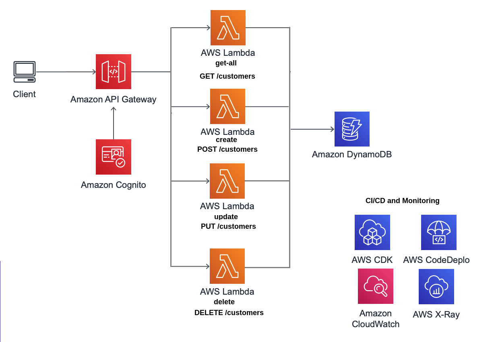
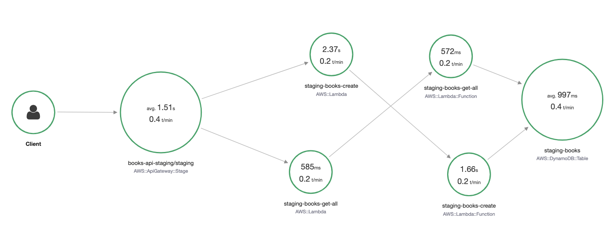

# Backend - Buy Now Pay Later Test 


## Architecture

Application is an RESTful API around the customer resource as requested. This API is implemented using Amazon API Gateway and Lambda where authentication is provided by Amazon Cognito. DynamoDB is the chosen data store.




## Project Structure

```tree
backend-buy-now-pay-later-test
 |- events        // HTTP request samples to test our app locally using sam local
 |- images        // images for this README
 |- pipeline      // CDK app defining a CI/CD pipeline for our API
 |- src           // source code
 |- template.yml
```

## CI/CD

```sh
Source -> Build -> Staging (Deploy + Test) -> Production (Manual approval + Deploy)
```
First let's connect  to Github:
  * Username is provided through a AWS SSM parameter called `github_username`,
  * Secret is provided through AWS Secrets Manager. Both secret name and field are called `github_token`.
  
Stages and actions are implemented using AWS CodePipeline, CodeBuild and CodeDeploy.

Pipeline itself is defined and provisioned by AWS CDK using Typescript.

To get it provisioned follow these steps:

* First, install AWS CDK Toolkit:

  ```sh
  npm install -g aws-cdk
  ```

* Then, fetch dependencies and provision pipeline:

  ```sh
  cd pipeline
  npm i
  npm run build
  cdk deploy
  ```

  There will be a summary of security-related changes that needs to be approved to continue with the CloudFormation template creation.

NOTES:

* This step needs to be implemented only once when starting to work on this project.
* Artifacts generated by the pipeline are stored in an Amazon S3 bucket called `ci-cd-pipeline-artifacts-{accountId}`.
* Artifacts which are specific for our application are stored in an Amazon S3 bucket called `customers-api-artifacts-{accountId}`.
* These buckets are created by our CDK script and hence, they cannot exist before running it.

* Build stage doesn't only generate our API artifacts, it also run a suite of unit tests for our AWS Lambda functions.
 
* Once the application is deployed in staging, end-to-end tests are executed in a automated way. These tests interact directly with the provisioned app. Certain paramters such as API endpoint or dynamodb table name are made available to this action through CloudFormation Outputs.

## Monitoring

AWS SAM CLI allows to monitor any lambda function given its logical id within a stack or its name as we would visualize them using Cloudwatch. For instance:

```sh
sam logs -n CreateCustomer --stack-name CustomersApiStaging --tail
```

## Tracing

Once we start interacting with our API through the two available endpoints, traces will be stored in AWS X-Ray since `TracingEnabled` was set to `true` in the definition of our `CustomersApi` in `template.yml`.

By navigating through the AWS console to AWS X-Ray, we can load the service map of our API and look for application issues, bottlenecks or specific areas that need improving.


## Getting a token to manually test the API

Any user that wants to create customers using the API directly, needs an OAuth2 token that grants access to the operation.

Since `template.yml` took care of provisioning all the necessary components from an infrastructure point of view, the only step left is to create such user and create a customer on his behalf:

1. Navigate to Cognito using the AWS console and choose "Manage User Pools", then the pool you want to create the user for (`staging-customers-api-user-pool` or `production-customers-api-user-pool`).
2. Go to "App client settings" under "App integration" and note down App client id and callback URL. Similarly, navigate to Domain name and make of a note of it (`customer-api-{env}-{accountId}`).
3. Open the Postman app 
4. Configure a new request: POST HTTP method and URL of our REST API.


5. In the authorization tab, select "OAuth 2.0" type, click on "Get New Access Token" and fill up the form with the values you took before:
 

6. First time, you will need to sign up by introducing email and password. You would need to confirm the user which you can do directly from the Cognito console in the "Users and groups" page. Going forward, you would only need to sign in as the user already exists.

7. Upon a successful signing in, you are given a token that you can attach directly to the HTTP request using the Authorization header.

8. At last, go to the Body tab and enter the customer you would like to create according to the schema defined in our functions (remenber to change the content-type of the request body to raw-JSON), click Send and all being well you should receive a  201 response code.

  
## Testing your lambda locally

Create a docker network and run a local dynamodb container in it:

```sh
docker network create my-network
docker run -d --network my-network -v "$PWD":/dynamodb_local_db -p 8000:8000 \
    --network-alias=dynamodb --name dynamodb \
    amazon/dynamodb-local -jar DynamoDBLocal.jar -sharedDb
```

Create the following table in the local DynamoDB:

```sh
aws dynamodb create-table --table-name customers \
    --attribute-definitions AttributeName=isbn,AttributeType=S \
    --key-schema AttributeName=isbn,KeyType=HASH \
    --endpoint-url http://localhost:8000 \
    --provisioned-throughput ReadCapacityUnits=5,WriteCapacityUnits=5
```

Check previous step ran successfully:

```sh
aws dynamodb list-tables --endpoint-url http://localhost:8000
aws dynamodb describe-table --table-name customers --endpoint-url http://localhost:8000
```

Finally, test your function with a dummy event (that can be generated with `sam local generate-event sqs receive-message`):

```sh
sam local invoke CreateCustomer -e events/create-customer-request.json --env-vars events/env.json --debug-port 5858 --docker-network my-network
sam local invoke GetAllCustomers -e events/get-all-customers-request.json --env-vars events/env.json --debug-port 5858 --docker-network my-network
```


